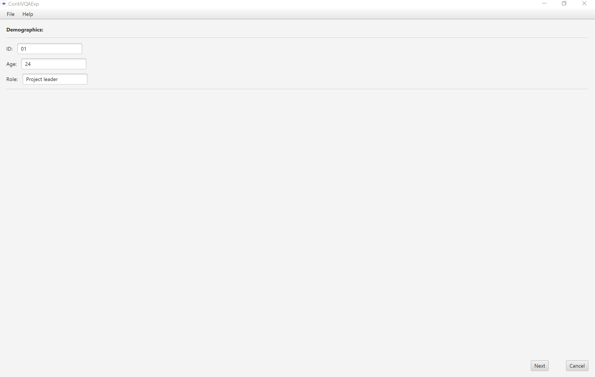

<!-- PROJECT LOGO -->
 

  

<h2 align="center">Continuous Video Quality Assessment Experiments 
<i>"Quality is in the Eye of the Beholder"</i></h2>

<!-- TABLE OF CONTENTS -->

  
Table of Contents

  <ol>
    <li><a href="#about-this-document">About this Document</a></li>
    <li><a href="#manage-experiments">Manage Experiments</a></li>
    <li><a href="#design-an-experiment">Design an Experiment</a></li>
    <li><a href="#collect-demographics">Collect Demographics</a></li>
    <li><a href="#conduct-continuous-video-quality-assessment">Conduct Continuous Video Quality Assessment</a></li>
    <li><a href="#enter-predefined-video-quality-assessment-form">Enter Predefined Video Quality Assessment Form</a></li>
    <li><a href="#analyze-assessment-data-of-single-subject">Analyze Assessment Data of Single Subject</a></li>
    <li><a href="#analyze-all-assessment-data">Analyze all Assessment Data</a></li>
  </ol>

<!-- ABOUT THIS DOCUMENT -->
## About this Document

    This document demonstrates the application of ContiVQAExp with screenshots and descriptions for designing, conducting, and analyzing subjective video quality assessment experiments. Each screenshot shows one of the central views of ContiVQAExp with explanations of the associated functions.

(<a href="#top">back to top</a>)

<!-- MANAGE EXPERIMENTS -->
## Manage Experiments

ContiVQAExp supports the management of experiments and their associated subjects to facilitate the experimenter's handling of the respective data sets. In addition, all collected data (demographics, continuous video quality assessments, results of the predefined assessment form on video quality, and internal analysis results) can be exported all as CSV files for subsequent analysis in other software tools.

(<a href="#top">back to top</a>)

<!-- DESIGN EXPERIMENT -->
## Design an Experiment

ContiVQAExp supports the design of video quality assessment experiments. An experiment includes a name, the video to be examined, a customizable set of demographics, a predefined assessment form for video quality, and a customizable input method for the continuous data collection during video playback. At the moment, the ContiVQAExp supports a slider as well as radio buttons as an input method. These input methods are completely customizable concerning the labels, the scale, and the number of radio buttons (2 - 10).

(<a href="#top">back to top</a>)

<!-- COLLECT DEMOGRAPHICS -->
## Collect Demographics

ContiVQA supports the collection of demographics at the beginning of an experiement session with a subject. These demographics can be defined as part of the experiment design and can be retrieved and exported in ContiVQA at any time.

(<a href="#top">back to top</a>)

<!-- CONDUCT EXPERIMENT -->
## Conduct Continuous Video Quality Assessment

In ContiVQAExp, a subject can continuously assess his or her current perception of a quality characteristic under investigation during video playback by the defined input method, in this case a slider. In case of problems, such as distractions, ContiVQAExp supports the repetition of the continuous assessment either completely or from a certain point in the video.

(<a href="#top">back to top</a>)

<!-- ENTER ASSESSMENT FORM -->
## Enter Predefined Video Quality Assessment Form

ContiVQAExp offers experimenters the possibility to use a predefined vision video quality assessment form after the continuous video quality assessment. Based on their proposed vision video quality model, [Karras et al.](https://www.sciencedirect.com/science/article/abs/pii/S0164121219302535) developed this assessment form to collect the subject's assessment of the overall quality and each quality characteristic of the quality model for vision videos. 

(<a href="#top">back to top</a>)

<!-- ANALYZE ASSESSMENT DATA OF SINGLE SUBJECT -->
## Analyze Assessment Data of Single Subject

(<a href="#top">back to top</a>)

<!-- ANALYZE ALL ASSESSMENT DATA -->
## Analyze all Assessment Data

(<a href="#top">back to top</a>)
